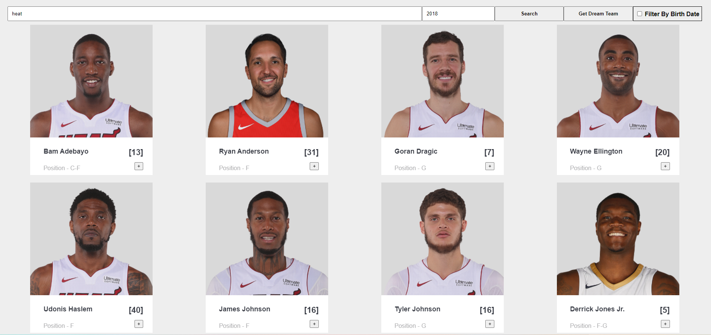
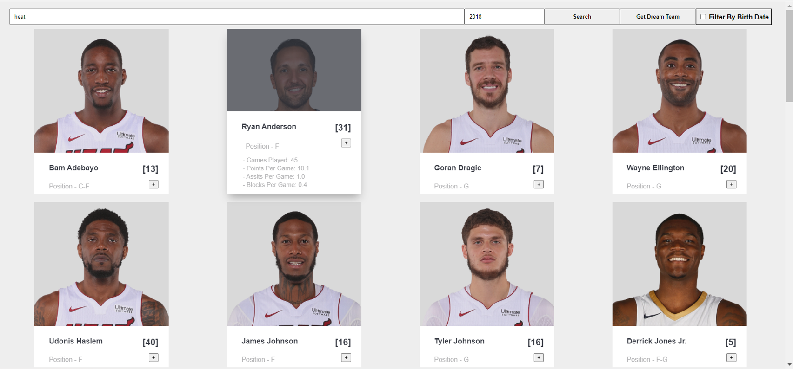
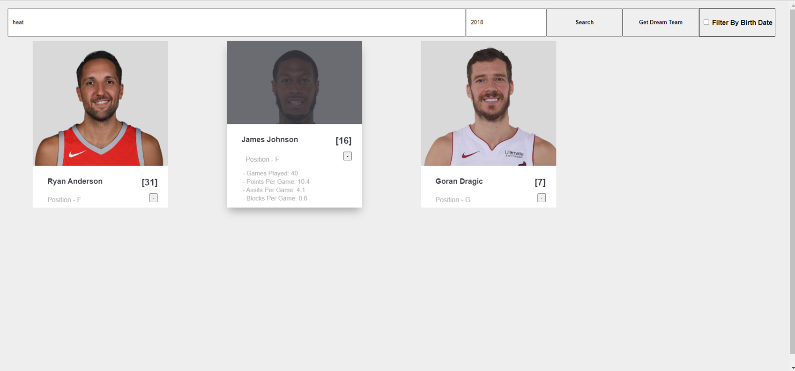

<H1> My NBA</H1>

My-NBA is a project which let the user search information
about players including their picture, position and jersey number.

The user enter the name of the team and the desired year and they get a galery of all the players fitting their search.

When the user hover on a specific player they will get the player 
stats.

In addition there is a functionallity that let the user create
a "Dream Team" which is a self made team which the user creates 
from different players from diffrent teams by clicking the "+" 
button next to each player.
(respectively removes a player by clicking the "-" button)

<H1> Screenshots </H1>

Example of player stats the user gets when they hover on the player:

Example of the "Dream Team" functionallity:

